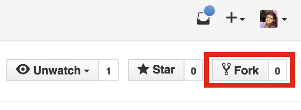
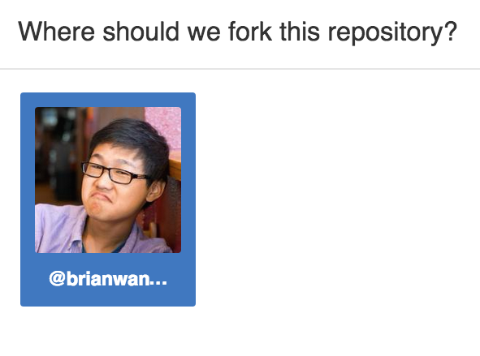

## Part 0: Setting up your Github

This tutorial will teach you how to build FlappyBird with Swift and SpriteBuilder. This tutorial was adapted from [MakeSchool's FlappyBird Tutorial](https://github.com/MakeSchool/FlappyBirdSwift-SpriteBuilder). Go check out www.makeschool.com/tutorials they've got some great stuff!

Github is a platform to easily save your code onto a cloud where you can track the changes you've made over time. It also allows others to see and contribute to your open source code. To set up github you need to do two things:

1. Sign up for an account at [Github](https://www.github.com)
2. Set up your github [SSH Keys](https://help.github.com/articles/generating-ssh-keys/)

Then, you need to fork our FlappyBird Template repository. Go to https://github.com/iosgatech/FlappyBirdSwift-Template, press the fork button on the top right, and select your own account to fork to.

</br>

</br>

</br>

Congratz! You now have forked a repository! You now have copied over the repository over to your account, which now you can freely manipulate without modifying the original repository!

But now you need to clone the repository that you just forked to your computer in order to edit it. After you have your repository forked, open up your terminal using <kbd>command</kbd> + <kbd>space</kbd> and then  typing in "terminal". Press enter and a terminal window should show up.

Navigate to the folder where you want to save your XCode projects. For example, if you would like to save your FlappyBird directly to the desktop, first `cd` to `~/Desktop` by typing this into the terminal and pressing enter

```
cd ~/Desktop
```

Proceed to clone the repository in that directory by typing in this line and replacing `**your-username**` with your github username:

```
git clone git@github.com:**your-username**/FlappyBirdSwift-Template.git
```

A folder called `FlappBirdSwift-Template` should show up

When you're done go to the [next step, Part 1](../P1/part1.md)
