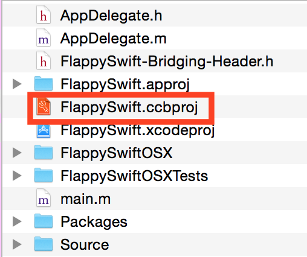
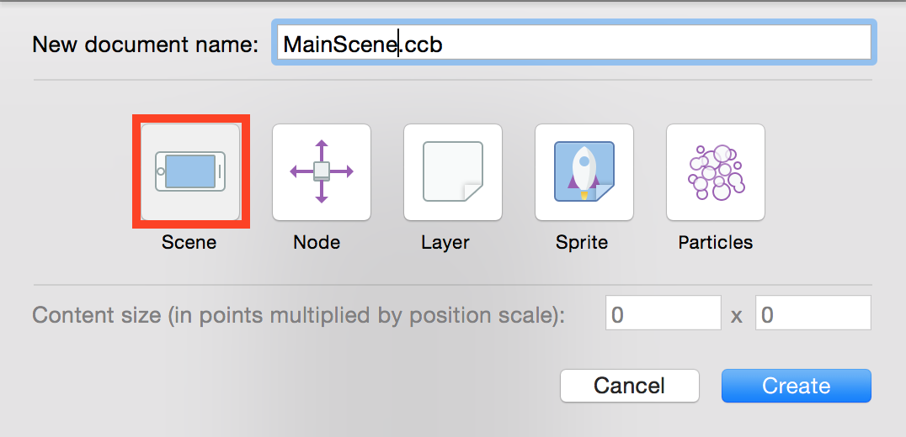
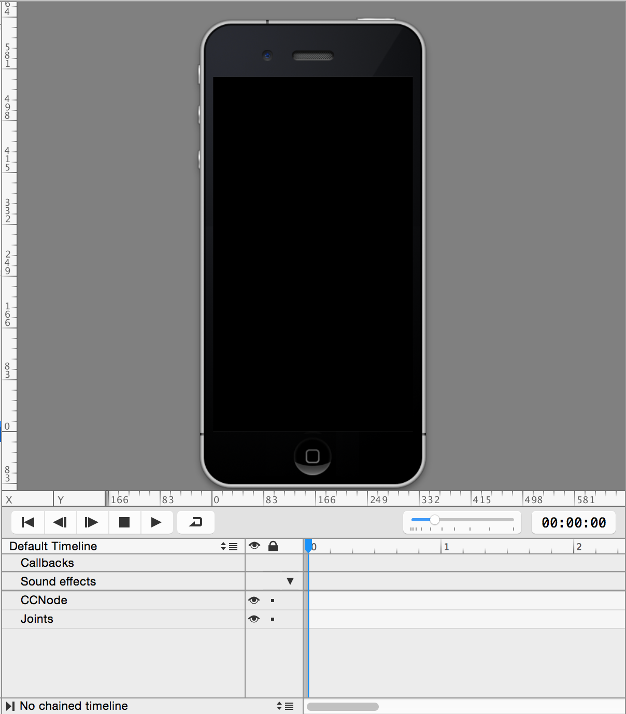
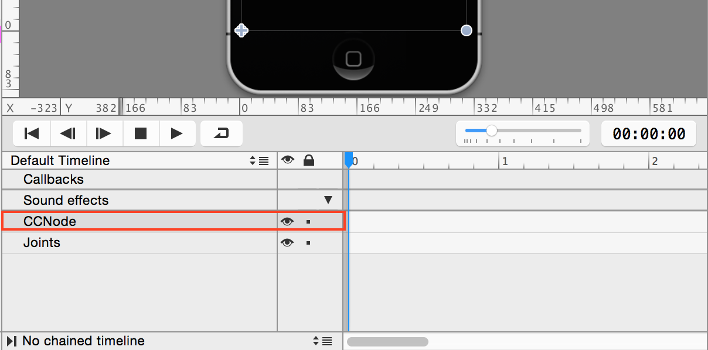
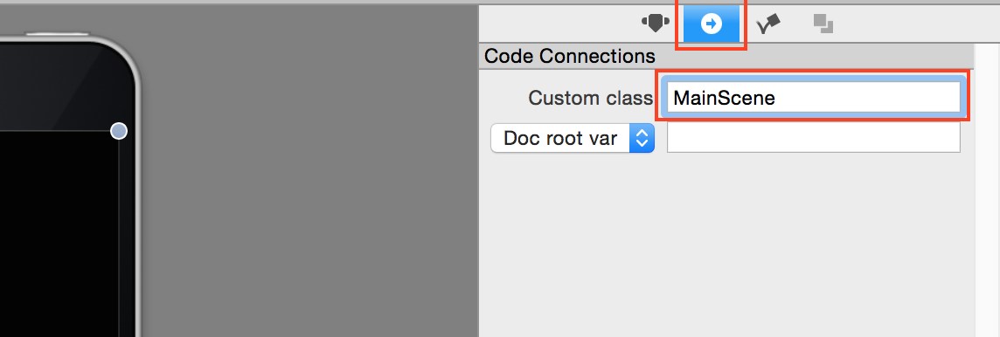
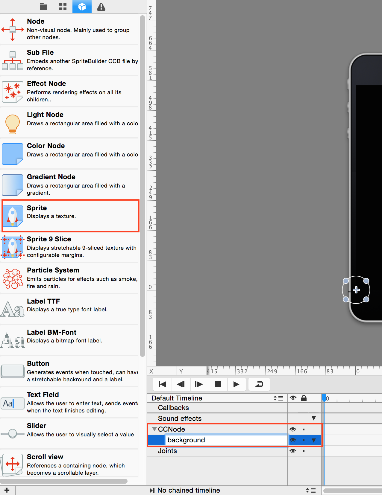
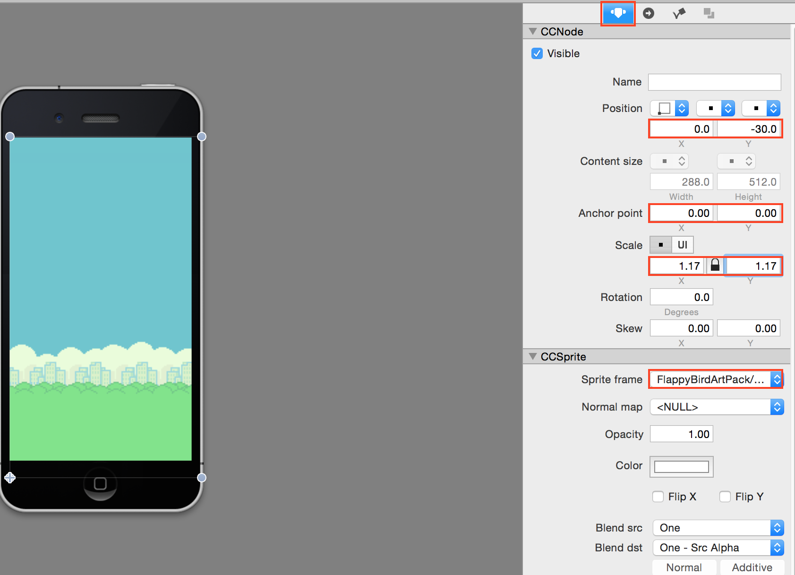
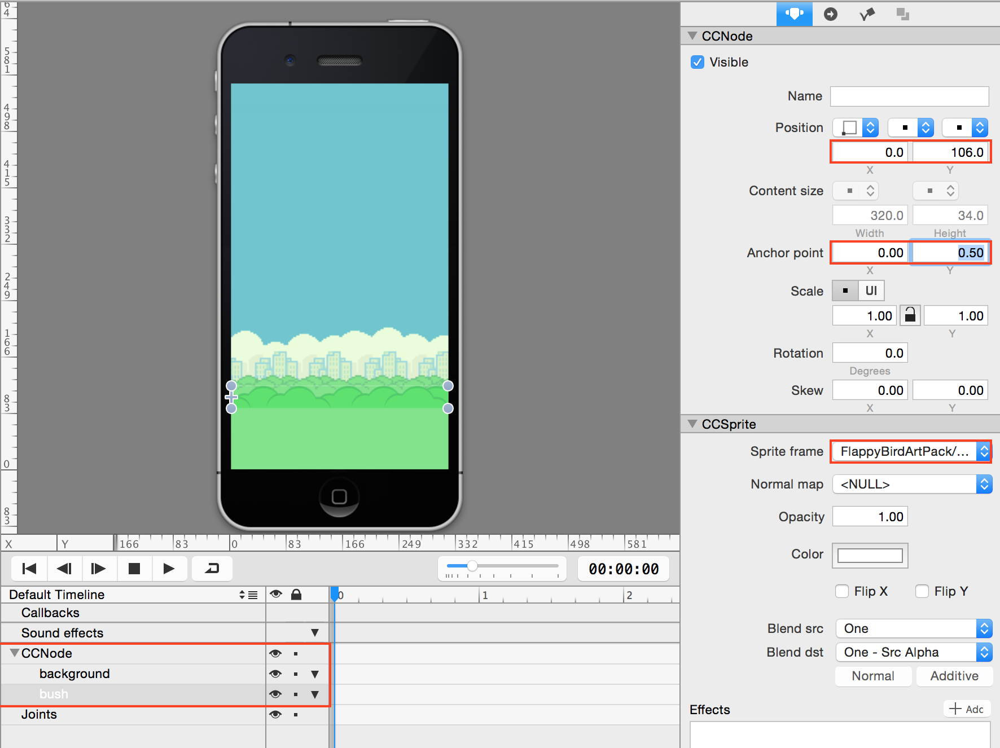

## Part 1: Setting up the MainScene (Spritebuilder Part 1)

Now we'll get into real game development. Use finder and open up your `.ccbproj` file in `FlappyBirdSwift-Template/FlappySwift.Spritebuilder`:

 

 

We want to create a new scene for our game. This spritebuilder scene will contain the assets and code connections for our actual code in XCode and will represent what we will see when we start up the application.

While in Spritebuilder, go to `File > New > File...` and create a .ccb called `MainScene.ccb` selecting the `Scene` option.

 

 

You should see a new iphone looking scene in the center of the screen.

 

 

Select `CCNode` in the area below the iphone screen underneath "Sound effects" This is the hierarchy area for all Cocos2D objects you add in including assets, physics objects, and other .ccb files. In this case, when you make a .ccb scene, the scene is represented by a special `CCNode` root.

 

 

On the right margin bar, click on the tab with the circle and arrow on it, second to the left. Here is where you will set your code connections to XCode so that your Scene and Cocos2D Objects are connected. Give the `CCNode` (which is known as the root node) a custom class, and call it "MainScene":

 

 

Next, click on the 3Dish box 3rd from the right on the left margin and click and drag a `CCSprite` to the root `CCNode` from earlier. This is where you go to add a new Cocos2D object so keep this in mind for the future. Go ahead and rename the `CCSprite` to "background" just to keep track of what we're doing. It won't affect the code or program in any way but it's nice to be clean and organized, especially with larger projects.

 

 

Then, select the "background" `CCSprite` node you just created, and click on the first tab on the right margin. Here you can edit the position, scale, and size of the object. `CCSprite` is a special subclass of `CCNode` that can contain an image. It can only be scaled and you cannot change the ratio of the image. Set the position to `0, -30`; the Anchor to `0, 0`; the scaling to `1.17, 1.17`; and the Sprite Frame to `FlappyBirdArtPack/background.png` as shown in the picture below

 

 

Great! You just set up your first Cocos2D object! Now we need to add the bushes and the ground. Go ahead and add another `CCSprite` below the background sprite (zOrder matters!) and set the position of the "bush" `CCSprite` to `0, 106`; Anchor point to `0, 0.5`; and the Sprite Frame to `FlappyBirdArtPack/bush.png`

 

 

When you're done go to the [next step, part 2](../P2/part2.md)
