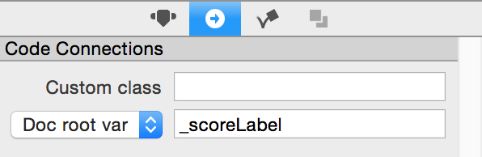
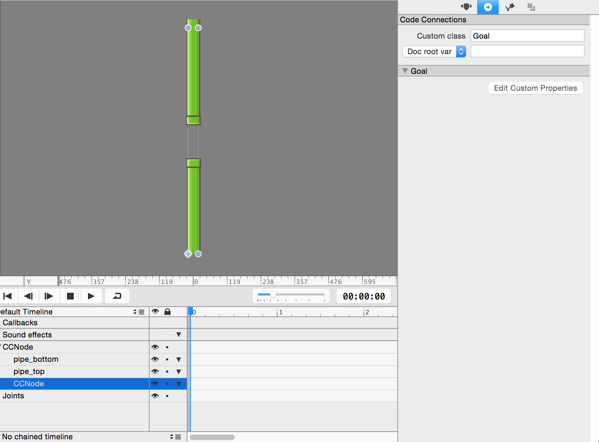

## Part 10: Setting up the Collisions (Points Collisions)

It's time to add a score counter at the top! Open SpriteBuilder and click on `MainScene.ccb`. We want to add a score label below the `restart button` node. Go ahead and drag a `Label TTF` underneath the `restart button`. Set its position relative to the **top left corner** (little button  with a square and a dot on a corner), and its position params to `165, 61`. Then Change the font name to whatever font you want, font size to `60` points, and the label text to "0". Finally, set the document root to `_scoreLabel`.

</br>

</br>
</br>

</br>

Click **publish** to save your change.

Now may notice earlier in part 7 that that you can't even go between the pipes because there's something blocking it. That's because there is a Cocos2D physics node between the pipes.

</br>

</br>

This is the "goal" node. It has a class called Goal.swift that determines it's properties. We want this node so that whenever the flappy bird collides with this node, it will increment the point counter. However, as a newly created physics object by default it will physically collide with other objects. We want to make it so that you can pass through the goal node, while stil calling the collision method to increment the points. We can do so by switching the `.sensor` property of the node to `true`.

In XCode, click on Goal.swift. Create a `didLoadFromCCB()` function in the class and add these two lines of code inside:

```
self.physicsBody.sensor = true
self.physicsBody.collisionType = "goal"
```

Switching `.sensor` to `true` allows objects to overlap and not physically collide, while still calling collision methods.

In addition, whereas for the other objects such as ground and the top and bottom pipes, we set the collision type to "level" in SpriteBuilder. In this case, we set the `.collisionType` of the Goal object to "goal" manually by code because we can and it's free. This shows how anything you can do in SpriteBuilder you can do the same in XCode (though with more effort and more lines of code). If you wanted to you could have went to spritebuilder and set the goal node's collision type to "goal" to achieve the same effect.

Let's set the sensor's true to the pipes as well to emulate the original flappy bird game more closely. It doesn't matter if the bird has to collide physically with the pipes because the game will end on collision anyway. This makes it so that there are no physical rebounds and bugs that appear with the pipes upon collision. In `Obstacles.swift`, add a didLoadFromCCB() method and add set the `.physicsBody.sensor` of `_topPipe` and `_bottomPipe` to `true`. **Do this yourself without copy and pasting code.**

Add two new variables to `MainScene.swift` at the top where you initialized the other file variables. One should be a `var` called `_scoreLabel` with a `weak` reference as a `CCLabelTTF!` optional type, and one should be a `var` called `points` as a `Int` intialized to `0`. **Do this yourself without copy and pasting code**

Finally let's create the collision method. We want this method to update whenever the "hero" collides and passes through the "goal" node. Add this method to `MainScene.swfit`.

```
func ccPhysicsCollisionBegin(pair: CCPhysicsCollisionPair!,hero: CCNode!,goal: CCNode!) -> Bool {
    goal.removeFromParent()
    points++
    _scoreLabel.string = String(points)
    return true
}
```

Go ahead and run your program. Your bird should be able to pass through the pipes and consequently update the score label.

When you're done go to the [next step, part 11](../P11/part11.md)
