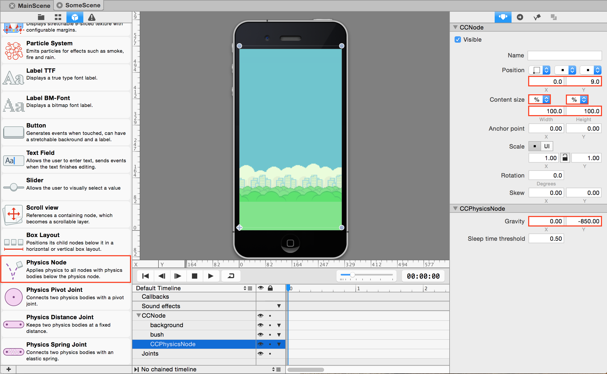
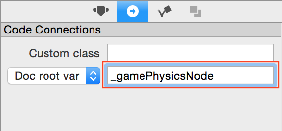
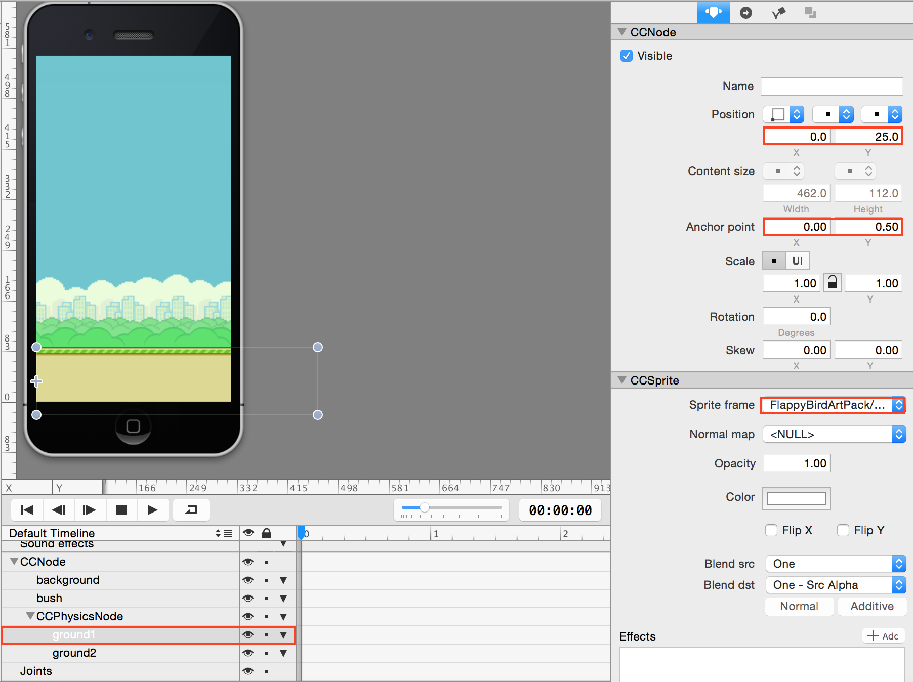
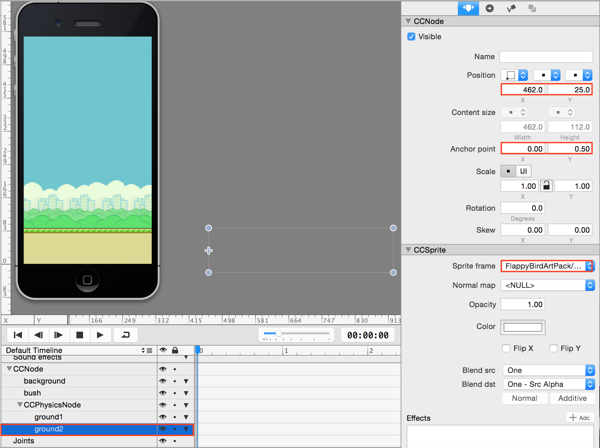
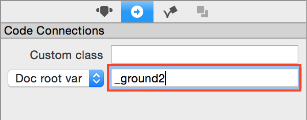
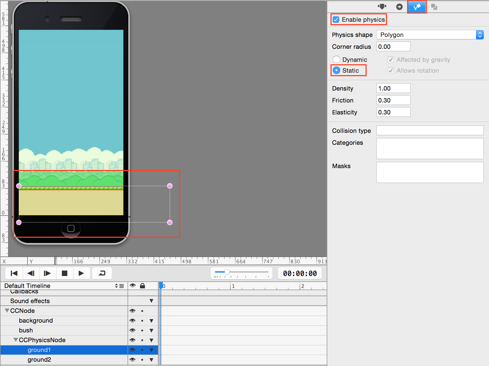

## Part 2: Setting up the MainScene (Spritebuilder Part 2)

Next you'll add the ground. We're going to add two ground sprites separately so that we can animate the ground to move. But before we can add ground sprites, we need to create a `CCPhysicsNode`. Since in the end, we want the ground to be a physical object that the bird collides with, we need physics container for all of our ground sprites, as well for our future physics objects as well, such as the obstacles and the Flappy Bird object.

From the Cocos2D object section in the left margin, drag a Physics Node object beneath the bush. Set it's position to `0, 106`; content size type to `%, %`; and gravity to `0, -700`.

 

 

Then while selecting the CCPhysicsNode, click on the circular button with the arrow, and set the document root to `_gamePhysicsNode`.

 

 

This is a code connection. Any time you reference the `_gamePhysicsNode` in MainScene.swift, it will refer to the object in the Spritebuilder scene, already initialized and ready to use.

**All objects that are affected by physics need to be a child of a CCPhysicsNode**, or in our case the `_gamePhysicsNode` connected physics node that we just created.

Go ahead and add **two sprites** underneath `CCPhysicsNode` and rename them to be "ground1" and "ground2".

For the ground1, set the position to `0, 25`; set the anchor to `0, 0.5`; set the Sprite Frame to `FlappyBirdArtPack/ground.png`, and then set the document root to `_ground1`

 

 
 

 

For the ground2, set the position to `462, 25`; set the anchor to `0, 0.5`; set the Sprite Frame to `FlappyBirdArtPack/ground.png`, and then set the document root to `_ground2`

 

 
 

 

Finally, we need to give the grounds physical aspects. **For both ground objects**, on the top right margin you'll see a "bouncing cube" tab. Click on it and check the box that says "enable physics". Then, click on the option for "static". You should see pinkish dots around the object you are selecting.

 

 

The vertices and edges of the pinkish area represent the physical boundaries of the object. As long as the object is a child of a `CCPhysicsNode` and physics is enabled, it can collide with other physical objects.

Great! You have now finished a very basic outline of your FlappyBird project! We'll come back to add more stuff later but for now, double check that both ground objects have physics enabled and are "static" objects, and then press the publish button on the top left:

 

 

When you're done go to the [next step, part 3](../P3/part3.md)
