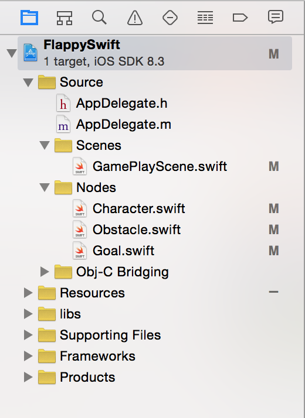

## Part 3: Understanding the Code

Open up the `FlappyBirdSwift-Template/FlappySwift.spritebuilder` folder with Finder and double click the `.xcodeproj` file. XCode should open.

</br>

</br>

Welcome to XCode! Here you will write code for the objects that you created in Spritebuilder. Here is where the explanations get lengthy so brace yourself.

In the left margin of XCode you'll see a whole bunch of files that we already have programmed for you.

</br>

</br>

Go ahead and take a brief look at the files and look over the code. **Make sure that when you're going through this tutorial to read and attempt to understand the code**, especially the code that we already wrote for you. This tutorial won't work unless you take the time to read the code and try to use it in your own applications.

#### Understanding Custom Class connections
In `Character.swift`, we have the code for FlappyBird, or whatever knockoff you want to make. If you take a look at `Character.ccb`, you'll notice that the root CCNode has a custom class set to "Character", and thus any `Character.ccb` object will be initialized with the code from `Character.swift`.

In `Obstacles.swift` we have class code for the obstacles/pipes and their initializations. `Obstacles.ccb` in Spritebuilder has a custom class set to "Obstacles", and therefore is initialized with code from `Obstacles.swift`.

In `Goal.swift` we have the initialization code for the `CCNode` that handles collisions for successfully getting between pipes. If you take a look at `Obstacles.ccb` in Spritebuilder, you'll notice that there is a child `CCNode` has a custom class called "Goal". This means that the CCNode in `Obstacles.ccb` is initialized with the code in `Goal.swift`.

**You see a pattern here? Objects that you create in Spritebuilder are initialized with their respective Custom classes**. Having a custom class allows you to directly manipulate objects in Spritebuilder in an organized, OOP matter.

#### Understanding Document Root connections
Also take a look at `GamePlayScene.swift`. This class is mainly just for animations, and the moving of the scene. In addition if you take a look at the variable initialization area:

</br>

</br>

You'll notice that it declares three variables with `_gamePhysicsNode`, `_ground1`, and `_ground2`. Remember when we wrote document roots for our CCPhysicsNode and ground objects in Spritebuilder? This means that `_gamePhysicsNode`, `_ground1`, and `_ground2` will all be initialized with those objects when the GamePlayScene code is run. Manipulating these variables will manipulate the document root linked objects in the Scene in real time. For example, if I wrote code in XCode to change the position of `_ground1`:

```
//hypothetical do not copy into XCode
_ground1.position = ccp(0, 0)
```
The ground1 object in the scene will change positions to `0,0` in real time. There is no need to write additional initialization code because the object is already initialized in `MainScene.ccb` via Spritebuilder

As for the `hero` variable, notice that it doesn't have an underscore "\_" before it. While the underscore doesn't do anything special for the code, it's personal convention to mark only objects linked through Spritebuilder with "\_". `hero` will be initialized separately in code and We'll show you how that's done in just a moment.

When you're done understanding go to the [next step, part 4](../P4/part4.md)
