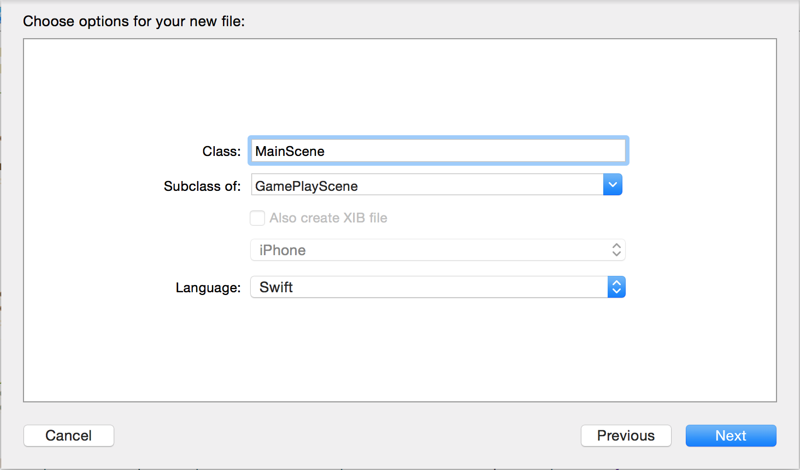
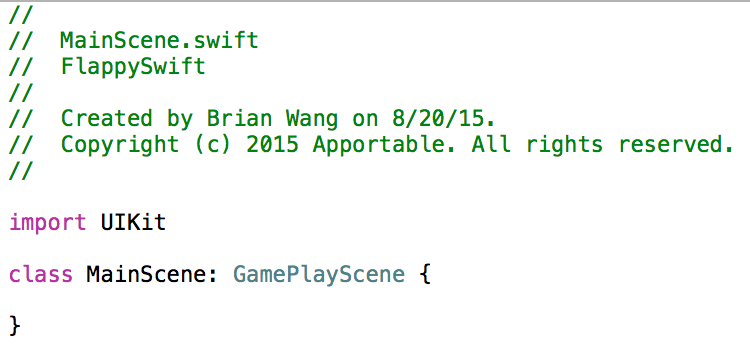
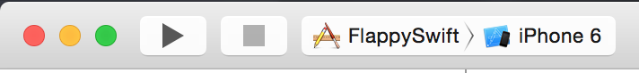
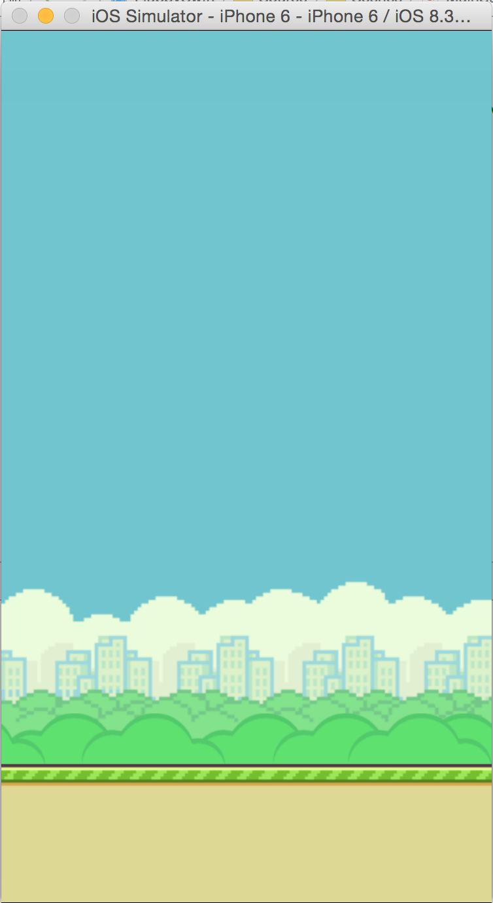
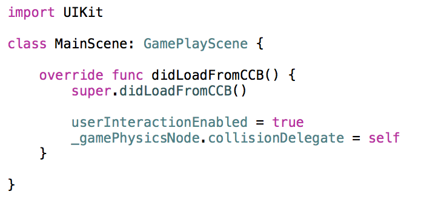

## Part 4: Setting up your MainScene (XCode)

Go to `File > New... > File...` And create a new Cocoa Touch Class. Call this new new class "MainScene" and make it a subclass of GamePlayScene.

</br>

</br>

Save it in `FlappySwift.spritebuilder/Source`, and then click on the newly selected `MainScene.swift` file. You should see this set of code:

</br>

</br>

This is how you initialize a subclass in Swift. You have the name of the class, a colon, followed by the name of the superclass. Now that the MainScene Class is created, `MainScene.ccb` will now be initialized with this class.

Go ahead and click on the play button in the top right of XCode:

</br>

</br>

This will compile the code and then run it in a separate iPhone simulator. You should see a screen like this, with the ground already being animated:

</br>

</br>

You can also change your simulator to other iPhone versions in order to test different screen sizes. If you don't have a retina screen and the simulator is too big, you can go to `Window > Scale` to change the size of the simulator.

Now that we've confirmed that the code works, let's initialize some variables. Between the class brackets, add a viewDidLoad() function:

```
override func didLoadFromCCB() {

}
```

This function will be called every time a `MainScene` object comes into view. When CCBReader loads all the `.ccb` files from Spritebuilder, it will send a didLoadFromCCB() function call to their `.swift` classes. Treat this like the initialization main function. You will be using this function **a lot** in order to initialize your Cocos2D objects.

The reason why we have the tag "override", there is already a `didLoadFromCCB()` function in `GamePlayScene`. If we're not inheriting the function, we're overriding it.

But, we don't want to completely override the didLoadFromCCB function, we just simply want to add on top of what GamePlayScene already has. Thus, add these lines of code between the function brackets:

```
override func didLoadFromCCB() {
    super.didLoadFromCCB()
}
```

This is how you call a function from the superclass. This makes it so that every time MainScene comes into view, it will first call didLoadFromCCB() from GamePlayScene before executing the additional initialization code. This way we can add additional code on top of the superclass's function.

Go ahead and now add a few more lines of code:

```
override func didLoadFromCCB() {
    super.didLoadFromCCB()

    userInteractionEnabled = true
    _gamePhysicsNode.collisionDelegate = self
}
```

If you want your users to interact with the screen (even a simple touch on a button) you will HAVE to set `userInteractionEnabled` to true. Inversely, if you set it to false, touching the screen will not do anything, even if you have touch, button, or gesture selectors implemented.

As for `_gamePhysicsNode`, notice how `GamePlayScene` implements the `CCPhysicsCollisionDelegate`? A **Delegate** is a tool to allow objects to work on the behalf, or in unison with another object that is not a superclass. In this case, we are setting the `GamePlayScene` to be a delegate for Cocos2D Chipmunk Physics, which allows `GamePlayScene` objects to implement CCPhysics collision functions. GamePlayScene now works on behalf of Cocos2D Physics, and can implement Cocos2D functions that were normally not possible. In other words, you can now program what happens when two objects collide directly into the MainScene class. This is why we set `_gamePhysicsNode.collisionDelegate` to `self`, because `self` represents the current MainScene object.

Your code should look like this in the end:

</br>

</br>

When you're done go to the [next step, part 5](../P5/part5.md)
