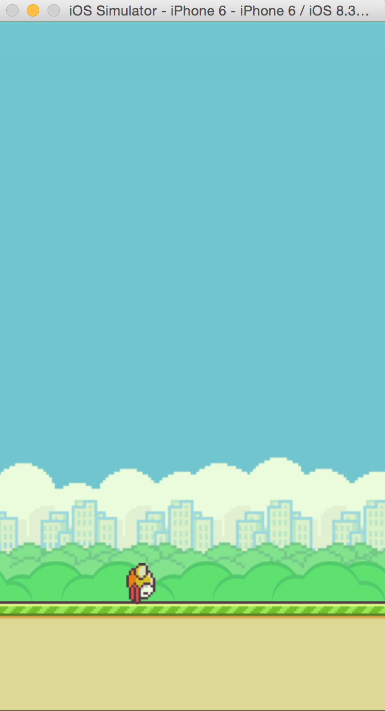

## Part 5: Setting up your FlappyBird (Part 1: Initialization)

Click on `Character.swift`. This is the class for the `Character.ccb`, or in other words, Flappy Bird. We're going to manually add Flappy Bird into the scene instead of using Spritebuilder, but before we do so we should write some initializations.

Let's set the initial position of the bird. By default, when the Flappy bird is initialized, it's position will be 0,0. We want the bird to be in the middle of the screen when MainScene starts, so in the class, add this function with this particular line of code inside:

```
func didLoadFromCCB() {
    self.position = CGPoint(x:115, y:250)
}
```

This will make it so that whenever you add a Flappy Bird object to the screen, it will be start at the position (115, 250) relative to the bottom left corner of the screen.

Now let's actually initialize and add the Flappy Bird. Click on `MainScene.swift` and in `didLoadFromCCB()`, add these lines of code:

```
hero = CCBReader.load("Character") as? Character
_gamePhysicsNode.addChild(hero)
```

The `CCBReader.load("Character")` function finds the published `Character.ccb` file and loads the sprite into `hero`. **However it does not actually get added into view until you add it as a child of another node in the Scene.** In this case, we add it to `_gamePhysicsNode` because it is a physics object. **Remember that all physics objects have to be a child of a CCPhysicsNode, otherwise physics functions will not work and the object will be static.**

Now run the program. You should see the Bird show up and drop to the ground.

</br>

</br>

When you're done go to the [next step, part 6](../P6/part6.md)
