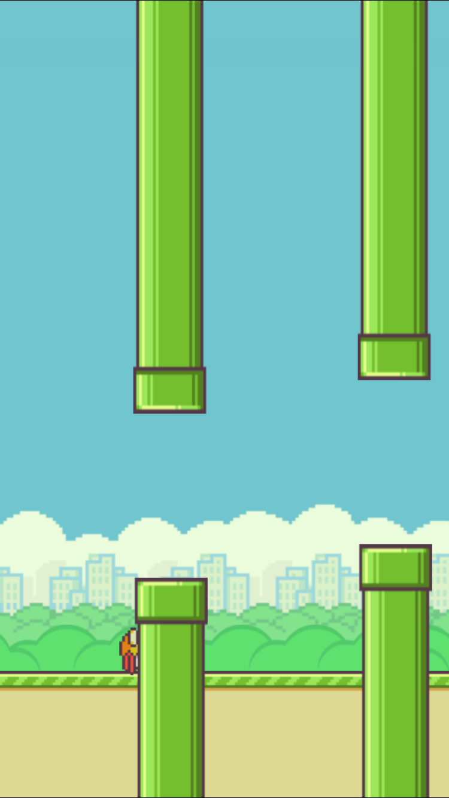
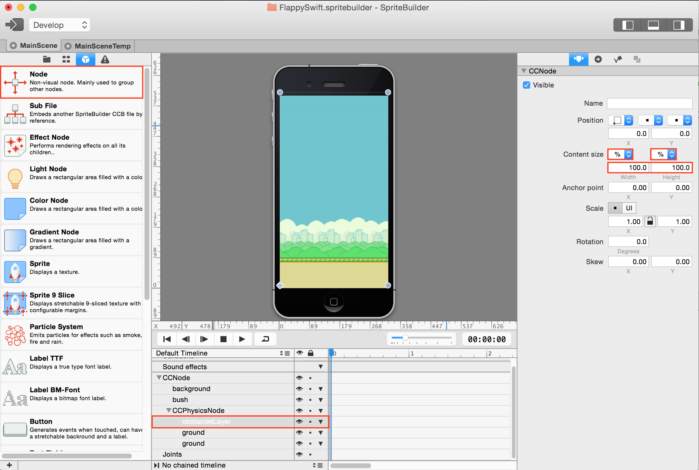
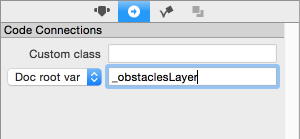
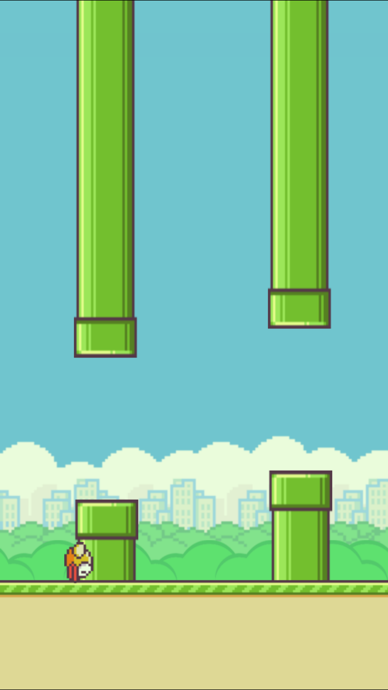

## Part 7: Setting up your Obstacles (Part 1: SpriteBuilder)

Now that you have your bird flappin', we gotta set up the obstacles, the pipes.

**Let** (haha pun) us set some constants first. above `didLoadFromCCB()`, right underneath the class header, add these "let" variables:

```
let firstObstaclePosition: CGFloat = 200
let distanceBetweenObstacles: CGFloat = 160
```

Then, we gotta write a `spawnNewObstacle()` function. Since we already have most of `Obstacle.swift` written for you, go ahead and add a new function to `MainScene.swift`

```
func spawnNewObstacle() {
    var prevObstaclePos = firstObstaclePosition
    if obstacles.count > 0 {
        prevObstaclePos = obstacles.last!.position.x
    }

    // create and add a new obstacle
    let obstacle = CCBReader.load("Obstacle") as! Obstacle
    obstacle.position = ccp(prevObstaclePos + distanceBetweenObstacles, 0)
    obstacle.setupRandomPosition()
    obstacles.append(obstacle)

    //add to scene
    _gamePhysicsNode.addChild(obstacle)
}
```

If you get errors about firstObstaclePosition or distanceBetweenObstacles, you probably put your "let" variables in the wrong place.

Then in the body of `didLoadFromCCB()`, add 3 pipes using the `spawnNewObstacle()` function using a for-loop.

```
// spawn the first obstacles
for i in 1...3 {
    spawnNewObstacle() //have them look this up on how to do a for loop
}
```

Go ahead and run the program now. What do you see?

</br>

</br>

We can see that the pipes are loaded in front of the ground. That is because the `zOrder` of the pipes is higher than the `zOrder` of the ground. The zOrder represents the draw order and the way that the layers are rendered in Cocos2D. When we added the pipes to `_gamePhysicsNode`, by default the `zOrder` of the pipe made it so that it shows up on top of the grounds. Every `CCNode` has a `.zOrder` property that we can manipulate and in SpriteBuilder you manipulate the `.zOrder` property directly by dragging the order in which objects are drawn. Alternatively you can set the `.zOrder` manually in XCode e.g. `obstacle.zOrder = 1` More information about `zOrder` can be found [here](http://www.learn-cocos2d.com/files/cocos2d-essential-reference-sample/Influencing_the_Draw_Order.html).

So how do we fix the draw order so that the pipes are in front of the background but behind the ground? We can add our obstacles to **a layer** that will be between the background and ground. Open up SpriteBuilder and open up `MainScene.ccb`. Drag a new `CCNode` inside of the `CCPhysicsNode`(remember that all pipes have to be a child of CCPhysicsNode to be a physics object) right above the two ground objects. Change the content size type to `%` and the content size parameters to `100, 100`. Finally, change the document root to `_obstaclesLayer`.

</br>

</br>
</br>

</br>

Press the **publish** button and go back to MainScene.swift. Underneath the obstacle constants that you created earlier, add a variable called `_obstaclesLayer`. Your variable section should look like this:

```
let firstObstaclePosition: CGFloat = 200
let distanceBetweenObstacles: CGFloat = 160

weak var _obstaclesLayer: CCNode!
```

Remember this will be initialized and connected to the `obstaclesLayer` node that we created earlier in SpriteBuilder. The `weak` reference makes sure that variable won't be deallocated (we'll go into detail later). We also want to force the variable to be an optional since we want to make sure straight from the bat that if _obstaclesLayer isn't initialized immediately after declaration, to stop the program and tell us what's wrong. If your program crashes it usually means that you mistyped the document root or forgot to put one in the first place.

Finally, we want to add our newly spawned obstacles to `_obstaclesLayer` instead of `_gamePhysicsNode`. in the `spawnNewObstacle()` function, replace the last line that says
```
_gamePhysicsNode.addChild(obstacle)
```
into:
```
_obstaclesLayer.addChild(obstacle)
```

Run the program and the pipes should appear in the right zOrder.

</br>

</br>

When you're done go to the [next step, part 8](../P8/part8.md)
