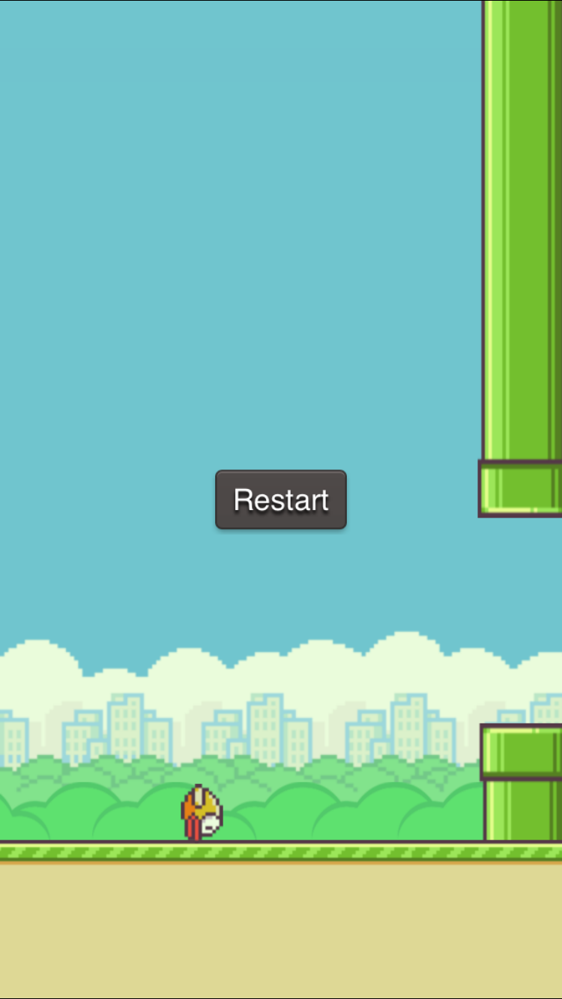

## Part 9: Setting up the Collisions (Game Over Collisions)

Now that we have most of assets set up, now we gotta set up the collision handlers. First let's set up the game over collisions, or collisions with the pipes or the ground. The idea is that when the bird makes contact with either the pipes or the ground, the game will end and a restart button will show up in the middle of the screen.

Open the project in SpriteBuilder and click on `Character.ccb`, then select the `CCSprite` root node. Click on the physics tab and look for a field called `Collision type`, and type in "hero" for the collision type.

</br>

</br>

Finally, click on `Obstacle.ccb` and select `pipe_bottom`.  Click on the physics tab and set "level" for the collision type. Do the same for `pipe_top`.

</br>

</br>

Then click on `MainScene.ccb` and select `ground1`, then set "level" for the collision type. Do the same for `ground2`.

</br>

</br>

In addition, let's add a restart button to MainScene.ccb. In the node menu, drag a generic button below the `CCPhysicsNode` **but not as a child of it**. Set it's position type to `%, %` and it's position to `50, 50`. Set it's `Title` to "Restart" and **uncheck** the `visible` checkbox up at the top. In addition, set the document root of the button to `_restartButton` and it's document selector to "restart"

</br>

</br>
</br>

</br>

When we set the document selector to "restart", every time the button is pressed it will call the function `restart()` in `MainScene.swift`. We're going to implement `restart()` later.

Making sure that the `visible` checkbox is unchecked makes it so that the restart button doesn't show up until we programmatically make it show up by setting `_restartButton.visible = true`. Consequently, when the button is not visible, it cannot call the restart() method in `MainScene.swift`.

Click on **publish** and switch back to XCode. In MainScene.swift, add the `restart()` function below:

```
func restart() {
    var scene = CCBReader.loadAsScene("MainScene")
    CCDirector.sharedDirector().replaceScene(scene)
}
```

This is how you change scenes, or in this case, restart a scene. When the `sharedDirector()` replaces the scene, the scene's memory allocation will be deallocated and thus a new MainScene will start over fresh.

So whenever the restart button is pressed it will call the selector `restart()` and restart the scene. Now we just have to program the button to become visible when the game is over. But first, in order to even make the button visible, we have to initialize the document root variable `_restartButton`. Underneath where you initialized `_obstaclesLayer`, add the `_restartButton` variable. Your variable section should look like this:

```
let firstObstaclePosition: CGFloat = 200
let distanceBetweenObstacles: CGFloat = 160

weak var _obstaclesLayer: CCNode!
weak var _restartButton: CCNode!
```

Next, add another function below called `gameOver()`:

```
func gameOver() {
    if (isGameOver == false) {
        //prevents update() in gamePlayScene from being called
        isGameOver = true

        //make the button show up
        _restartButton.visible = true

        //stop scrolling
        scrollSpeed = 0

        //stop all hero action
        hero?.rotation = 90
        hero?.physicsBody.allowsRotation = false
        hero?.stopAllActions()

        //shake the screen
        var move = CCActionEaseBounceOut(action: CCActionMoveBy(duration: 0.1, position: ccp(0, 4)))
        var moveBack = CCActionEaseBounceOut(action: move.reverse())
        var shakeSequence = CCActionSequence(array: [move, moveBack])
        runAction(shakeSequence)
    }
}
```

Now we'll actually implement the collision function. Add another function in `MainScene.swift` that will handle the collision between `level` and `hero` objects:

```
func ccPhysicsCollisionBegin(pair: CCPhysicsCollisionPair!, hero: CCNode!,level: CCNode!) -> Bool {
    gameOver()
    return true
}
```

Notice how our parameters are called `hero:` and `level:`? That means any Cocos2D Physics object with the collision type as "hero" will call this function on collision with another physics object with the "level" type collision. Don't ask me why it's just how it works. Alternatively you can set the parameters to `wildcard:` which will make it so that any object with any collision type will call the function. In addition to `ccPhysicsCollisionBegin` There's also `ccPhysicsCollisionPreSolve`, `ccPhysicsCollisionPostSolve`, and `ccPhysicsCollisionSeperate`. More information about these particular methods can be found on the [Cocos2D Documentation](http://cocos2d.spritebuilder.com/docs/api/Protocols/CCPhysicsCollisionDelegate.html)

Now run the program and crash into a pipe and the ground. The app should game over and a restart button should appear in the middle of the screen.

</br>

</br>

If your restart button is showing up before the game is over, you probably forgot to uncheck the `visible` checkbox for the restart button in SpriteBuilder.

You'll probably also notice that if you tap on the screen when the game is over, your bird flies. Thats because even after game is over, you can still apply physics to the objects. Fix this problem by using an if statement that checks if the game is not over. In `touchBegan()`, modify your code to look something like this:

```
override func touchBegan(touch: CCTouch!, withEvent event: CCTouchEvent!) {
    if (!isGameOver) {
        // move up and rotate
        hero?.flap()

        //resets the time so that the bird doesn't rotate immediately after jumping
        sinceTouch = 0;
    }
}
```

When you're done go to the [next step, part 10](../P10/part10.md)
