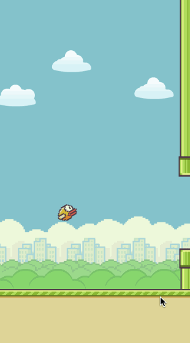

## Build FlappyBird!

This tutorial will teach you how to build FlappBird with Swift and Spritebuilder.

You will learn:
- Swift Syntax
- Object Oriented Programming
- Github
- Spritebuilder

##### [Part 0: Setting up your Github](P0/part0.md)
##### [Part 1: Setting up the MainScene (Spritebuilder Part 1)](P1/part1.md)
##### [Part 2: Setting up the MainScene (Spritebuilder Part 2)](P2/part2.md)
##### [Part 3: Setting up your MainScene (XCode)](P3/part3.md)
##### [Part 4: Github Break!](P4/part4.md)
##### [Part 5: Setting up your FlappyBird](P5/part5.md)
##### [Part 6: Setting up your Obstacles](P6/part6.md)
##### [Part 7: Setting up the Collisions (Spritebuilder)](P7/part7.md)
##### [Part 8: Setting up the Collisions (XCode)](P8/part8.md)
##### [Part 9: Tweaking the code](P9/part9.md)
